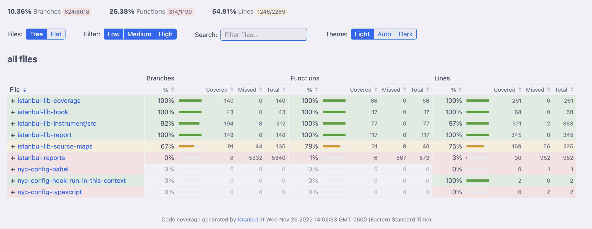
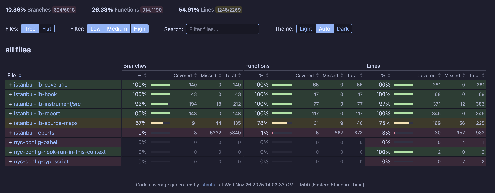

# istanbul-reporter-html-dark

Istanbul HTML reporter with dark mode support and enhanced features. A fork of `istanbul-reports` with theming, file filtering, and improved aesthetics.

| Light Mode | Dark Mode |
|------------|-----------|
|  |  |

## Features

- **Theme Toggle**: Light / Auto / Dark mode with manual override
- **File Name Filter**: Search/filter files in the coverage tree
- **Catppuccin Colors**: [Catppuccin](https://github.com/catppuccin/catppuccin) Latte (light) and Mocha (dark) color schemes
- **Inline SVG Icons**: No external image dependencies
- **Theme Persistence**: Your theme choice persists across pages via localStorage

## Installation

```bash
npm install istanbul-reporter-html-dark
```

## Usage

### With c8
```bash
c8 --reporter=istanbul-reporter-html-dark npm test
```

### With nyc
```bash
nyc --reporter=istanbul-reporter-html-dark npm test
```

## Development

### Build the React bundle
```bash
npm run build
# or watch mode
npm run build:watch
```

### Project structure
```
├── index.js                 # Entry point (exports reporter class)
├── lib/
│   ├── html/                # Detail page reporter (per-file view)
│   │   ├── assets/
│   │   │   ├── base.css     # Theme styles + CSS variables
│   │   │   └── vendor/
│   │   │       └── prettify.css  # Syntax highlighting (Catppuccin)
│   │   └── index.js         # Includes theme persistence script
│   └── html-spa/            # Summary SPA reporter
│       ├── assets/
│       │   ├── spa.css      # Theme styles + CSS variables
│       │   └── bundle.js    # Built React app (gitignored, built on publish)
│       ├── src/
│       │   ├── index.js     # Main app with theme state management
│       │   ├── themeToggle.js    # Light/Auto/Dark toggle component
│       │   ├── fileNameFilter.js # File search/filter component
│       │   └── ...
│       └── webpack.config.js
```

### Key files for customization

**Theming (CSS variables):**
- `lib/html-spa/assets/spa.css` - SPA styles with `:root`, `@media (prefers-color-scheme: dark)`, `.theme-light`, `.theme-dark`
- `lib/html/assets/base.css` - Detail page styles (same pattern)
- `lib/html/assets/vendor/prettify.css` - Syntax highlighting colors

**Theme Toggle (React):**
- `lib/html-spa/src/themeToggle.js` - Toggle component
- `lib/html-spa/src/index.js` - Theme state management + localStorage

**Theme Persistence (Detail Pages):**
- `lib/html/index.js` - Inline script reads localStorage before render

### Color Palette

Uses [Catppuccin](https://github.com/catppuccin/catppuccin):
- **Light mode**: Catppuccin Latte with boosted contrast for syntax highlighting
- **Dark mode**: Catppuccin Mocha

## Publishing

### Preview what will be published
```bash
npm pack --dry-run
```

### Publish flow
```bash
npm version patch  # or minor/major
npm publish
```

The `prepare` script automatically builds `bundle.js` before publishing.

**Note:** `bundle.js` is gitignored but included in the npm tarball via the `files` field.
